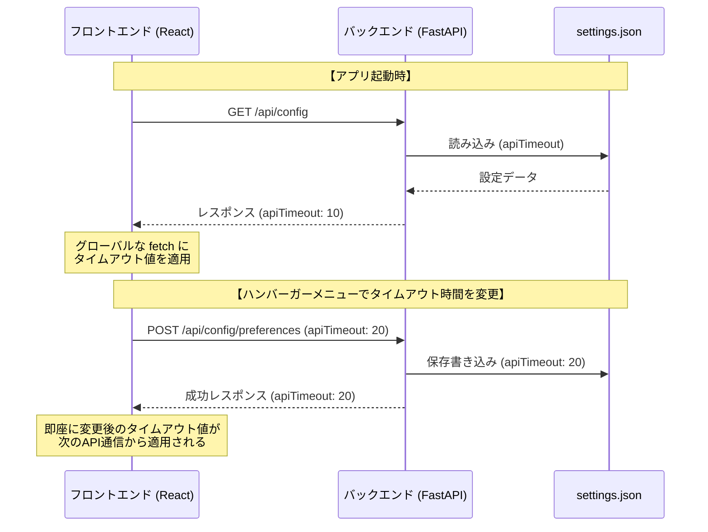
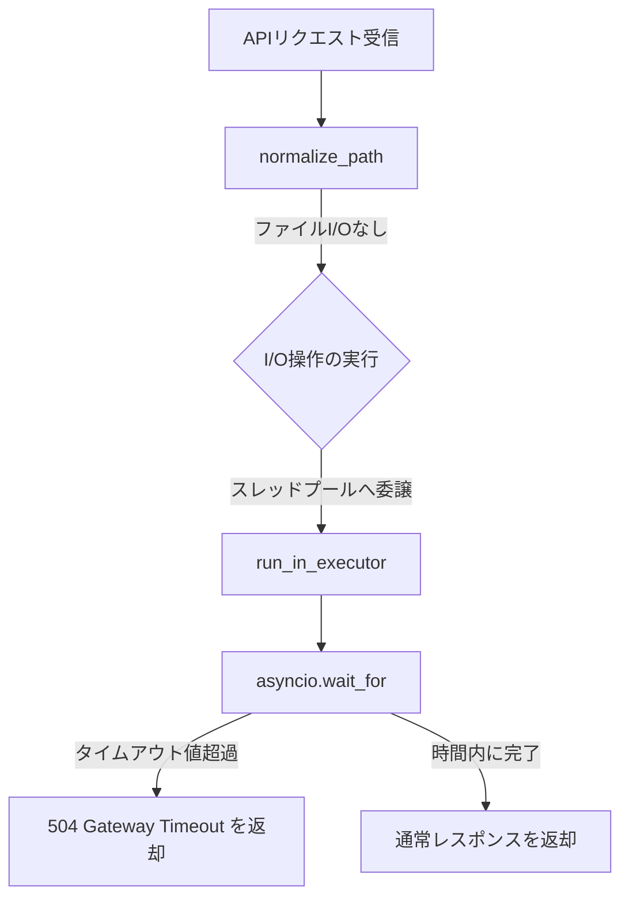

# APIリクエスト タイムアウト設定・フリーズ防止機能 仕様書

本ドキュメントは、ネットワークドライブが遅い環境におけるAPIリクエストおよびバックエンドのタイムアウト動作、ならびにハング防止（フリーズ回避）設計について説明します。

---

## 1. 概要
社内NASなどの遅延が大きいネットワーク共有フォルダにアクセスする際、以下の要因でシステム全体がフリーズするのを防ぎます。
1. **フロントエンドからの切断**: 応答がないリクエストを一定時間（デフォルト10秒）で強制的に打ち切り、トースト通知でユーザーへ知らせる。
2. **バックエンドのハング防止**:
   - `normalize_path` でのファイル実在チェック（`Path.resolve()`）はI/Oハングを引き起こすため、文字列計算のみの高速な判定に変更。
   - 主要なファイルI/Oアクセス（存在チェック、走査、開く、読み込み）をバックグラウンドスレッドで実行し、指定されたタイムアウト（秒）経過時に `504 Gateway Timeout` エラーとしてリクエストを打ち切る。

タイムアウト時間のデフォルトは **10秒** ですが、ハンバーガーメニューから任意の時間（1〜300秒）にカスタマイズし、バックエンドの `settings.json` へ保存して動的に同期されます。

---

## 2. アーキテクチャと処理フロー

### 2.1. 設定の保存と流れ
タイムアウト設定値は、バックエンドの `settings.json` に保存され、起動時にフロントエンドが取得・適用します。

### 2.2. バックエンド側のフリーズ・タイムアウト対策 (I/O制限)
ネットワークドライブの接続切断時、`Path.exists()` や `open()` などを直接呼び出すと、OSレベルのタイムアウト（数分間）が発生するまでスレッドがハングします。
これを回避するため、バックエンド側で以下の対策を講じています。

- **I/Oフリーなパス正規化 (`normalize_path`)**:
  シンボリックリンク解決を行わず、文字列操作（`os.path.normpath`ベース）のみでパス正規化とパストラバーサル防止チェックを行うことで、パス解決時のI/Oハングを完全に防止します。
- **タイムアウト制限付き実行 (`run_with_timeout`)**:
  同期的なファイル操作処理をスレッドプールに委譲し、`asyncio.wait_for` を使って設定時間（`apiTimeout`）で監視・打ち切りします。

### 2.3. 対象の主要API
以下のAPIが `run_with_timeout` によるタイムアウト保護の対象です：
- `/api/files` (`get_files`): ファイル一覧取得・走査・実在確認
- `/api/path-info` (`get_path_info`): パス実在確認
- `/api/open/smart` (`open_smart`): パス実在確認およびファイル読み込み
- `/api/file-content` (`get_file_content`): ファイル実在確認およびテキスト読み込み
- `/api/open-path` (`open_path`): パス実在確認およびOSアプリ起動

---

## 3. 設定UI (ハンバーガーメニュー)
ヘッダー右上のハンバーガーメニューを開き、**「Network Settings」** の下にある **「API Timeout (sec)」** に秒数を直接入力します。フォーカスを外すか値を変更した時点で、設定は自動的にバックエンドに保存されます。

---

## 4. タイムアウト発生時の挙動
APIリクエストが設定したタイムアウト時間に達すると、通信が強制的に中断され、フロントエンド上に以下のエラーメッセージがトーストとして通知されます。

> ⚠️ **エラー通知例**
> `リクエストがタイムアウトしました（設定値: 10秒）。ネットワークドライブが遅いか、サーバーが応答していません。`
> または
> `処理がタイムアウトしました（設定値: 10秒）。ネットワークが遅い可能性があります。`
